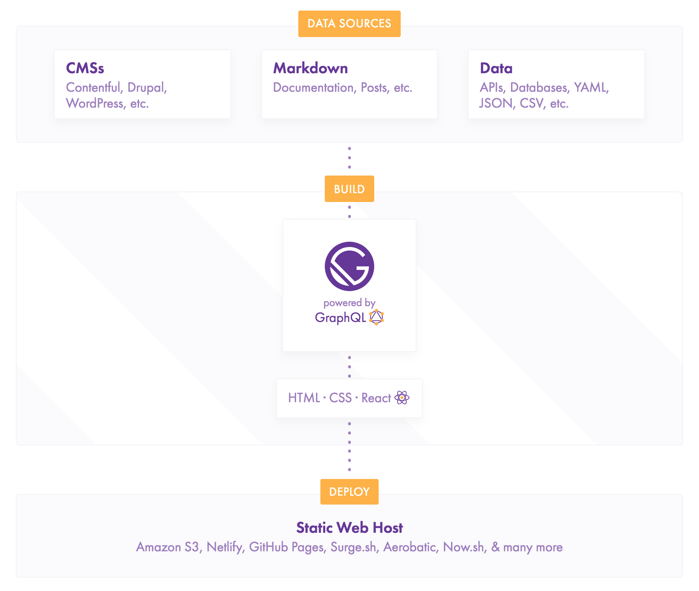

# Project Architecture

## Overview

This project is a [Gatsby](https://www.gatsbyjs.org/) project.



### Data Sources

Our current data sources are:

- markdown files in the `src/pages` folder
- the google spreadsheets API, which is where we pull in future classes

### Build Process

The build process uses GraphQL to bring our data sources into our page templates.

Here's an example of how that might look

```
+-------------------------------------------------------------------------+
| `layouts/index.js` (navigation and footer)                              |
|                                                                         |
| +---------------------------------------------------------------------+ |
| | `templates/district-class.js` (determines how data is displayed)    | |
| |                                                                     | |
| | +-----------------------------------------------------------------+ | |
| | | `pages/classes/web-design.md` (where the data pulls from)       | | |
| | |                                                                 | | |
| | |                                                                 | | |
| | +-----------------------------------------------------------------+ | |
| |                                                                     | |
| +---------------------------------------------------------------------+ |
|                                                                         |
+-------------------------------------------------------------------------+

```

All you need to do to add a new class, is add a new `.md` file to the `classes` folder. This is pretty magical, so we'll cover that in more depth later.

### Static Web Hosting

The build process creates a really nice and simple website inside of the `public` folder. We use [Netlify](https://www.netlify.com/) to automatically build and deploy our site. If you look at your pull requests, you'll notice Netlify is automatically trying to build this project. If that's successful, then you can merge, and your changes will automatically be built into the new site.
